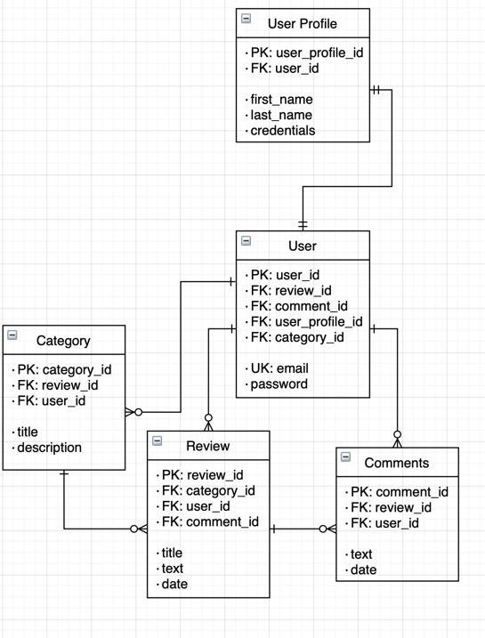

## Content Review Database
This backend will allow the client to save users who then proceed to provide
their reviews on subjects and content of their choice. Each user can leave a
review that will fall under any particular category of the users choosing. Under
 each review, other users can leave comments as well.

In consideration of the user experience, users will only be able to use a First
and Last name and not a custom defined user name. This will provide a communal
experience that lends itself towards a sense of community.

## User Stories
* As a User I want to register
* As a User I want to login
* As a User I want to Create, Read, Update and Delete a Category
* As a User I want to Create, Read, Update and Delete a Review
* As a User I want to Create, Read, Update and Delete a Comment
* As a User I want to get all Categories regardless of User 
* As a User I want to get all Reviews under a Category regardless of User 
* As a User I want to get all Comments under a Review regardless of User 

## Domain Models

--------------
## Application Set-Up
* Dependencies: 
   * Spring v2.4.4
   * PostgreSQL v13.2
  ------
1. Make a database with a name that matches application properties in resources
2. Clone this repo
3. Set up POST requests in Postman
4. Run the application
5. Send the request's setup in part 2

* IntelliJ spring set up 
  * application.properties
  * application-dev.properties
  * pom.xml maven dependencies
  * Models
  * Repositories
  * Security & Users
  * Service Layer
  * Exception Handling
* Database setup
* Project Structure
* GitHub setup

----------------
## Progress
- [x] MileStone:
Hello World REST end-point test
- [x] Milestone: Basic Models in place 
  * User 
  * User Profile 
  * Category 
  * Review 
  * Comments
- [x] Milestone: Controllers 
- [x] Milestone: Services 
- [x] Milestone: Exceptions
- [X] Milestone: Adding Relations between models
  * Category 
  * Reviews 
  * Comments
- [X] Milestone: Spring Security
- [X] Milestone: JWT token implementation
- [X] Unit Testing
- [X] Public read only of content 
- [X] User can do full CRUD operations on the categories they created

## Testing and Security

# Interation Tests
We used on the controller class to verify correctedness with end point behaviour suinf Mockito.

# Unit Tests
We also instantiated unit testing on the repository to confirm integrity of repository/data layer

# Custom Security Context for Authentication
We found our controller tests failed unless we had a user saved to the Security context. This was acheived with a custom annotation @WithCustomUser(username="{insertname}" and also a Security Context Factory

With that we are able to test whether authentication is working or not with the below testing method:

## User Specific Requests
| REQUEST TYPE     | END POINT | PAYLOAD | RESULTS |
| :-----------: | :-----------: | :-----------: |:-----------: |
|**GET**| http://localhost:9092/api/categories|N/A|Categories List|
|**POST**| http://localhost:9092/api/categories|Category|Create Category|
|**GET**| http://localhost:9092/api/categories/{{categoryId}}|Category ID|Get Category|
|**PUT**| http://localhost:9092/api/categories/{{categoryId}}|Category, Category ID| Update Category|
|**DELETE**| http://localhost:9092/api/categories/{{categoryId}}|Category ID| Delete Category|
|**GET**| http://localhost:9092/api/categories/{{categoryId}}/reviews|Category ID|Reviews List|
|**POST**| http://localhost:9092/api/categories/{{categoryId}}/reviews|Category ID, Review|Create Review|
|**GET**| http://localhost:9092/api/categories/{{categoryId}}/reviews/{{reviewId}}|Category ID, Review ID| Get Review|
|**PUT**| http://localhost:9092/api/categories/{{categoryId}}/reviews/{{reviewId}}|Category ID, Review ID, Review|Update Review|
|**DELETE**| http://localhost:9092/api/categories/{{categoryId}}/reviews/{{reviewId}}|Category ID, Review ID| Delete Review|
|**GET**| http://localhost:9092/api/categories/{{categoryId}}/reviews/{{reviewId}}/comments|Category ID, Review ID| Comment List|
|**POST**| http://localhost:9092/api/categories/{{categoryId}}/reviews/{{reviewId}}/comments|Category ID, Review ID, Comment| Create Comment|
|**GET**| http://localhost:9092/api/categories/{{categoryId}}/reviews/{{reviewId}}/comments/{{commentId}}|Category ID, Review ID, Comment ID| Get Comment|
|**PUT**| http://localhost:9092/api/categories/{{categoryId}}/reviews/{{reviewId}}/comments/{{commentId}}| Category ID, Review ID, Comment ID, Comment| Update Comment|
|**DELETE**| http://localhost:9092/api/categories/{{categoryId}}/reviews/{{reviewId}}/comments/{{commentId}}|Category ID, Review ID, Comment ID| Delete Comment|
|**POST**| http://localhost:9092/auth/users/create|User|Create User|
|**POST**| http://localhost:9092/auth/users/login|Login Request|Authentication for login|
|**POST**| http://localhost:9092/auth/users/register|User Profile| Create User Profile|

## Public Requests
| REQUEST TYPE     | END POINT | PAYLOAD | RESULTS |
| ----------- | ----------- | ----------- |----------- |
|**GET**| http://localhost:9092/categories| N/A| Category Lists
|**GET**| http://localhost:9092/categories/{{categoryId}}| Category ID| Category|
|**GET**| http://localhost:9092/categories/{{categoryId}}/reviews|Category ID| Review List|
|**GET**| http://localhost:9092/categories/{{categoryId}}/reviews/{{reviewId}}|Category ID, Review ID| Review|
|**GET**| http://localhost:9092/categories/{{categoryId}}/reviews/{{reviewId}}/comments|Category ID, Review ID| Comment List
|**GET**| http://localhost:9092/categories/{{categoryId}}/reviews/{{reviewId}}/comments/{{commentId}}|Category ID, Review ID, Comment ID| Comment
